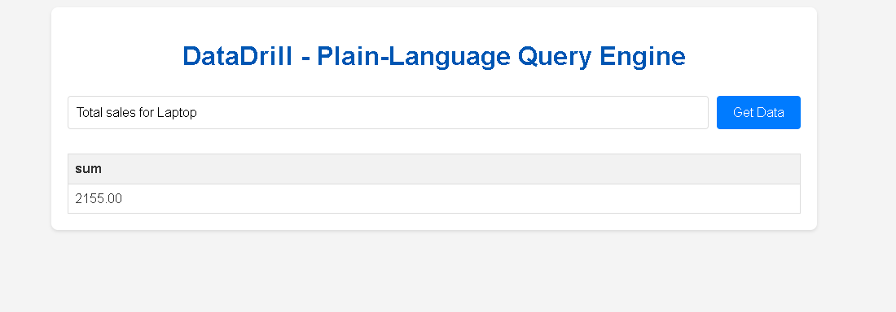

# DataDrill – Plain-Language Query Engine

## Aim

To build an API that translates English queries into SQL, executes them against a sample database, returns results, and displays them in a web UI.

## Overview

DataDrill is a plain-language query engine that allows users to retrieve information from a PostgreSQL database using natural language sentences. It processes user queries, translates them into valid SQL using a rule-based NLP parser built with spaCy, executes the SQL against a sample PostgreSQL database, and displays the results dynamically in a user-friendly web interface.

## Detailed Steps & Features Implemented

This project covers the following components:

1.  **Project Setup:** Basic Python project structure with Flask.
2.  **Sample Database:** A PostgreSQL database (`datadrill_db`) populated with sample `users` and `orders` data.
3.  **Query Endpoint:** A Flask API endpoint (`/query`) that accepts plain-language text queries.
4.  **NLP Mapping (using spaCy and regex):**
    * Translates various English phrases into SQL `SELECT`, `FROM`, `WHERE`, `COUNT(*)`, `SUM()`, and `GROUP BY` clauses.
    * Handles specific entities like names, product names, email addresses, and numerical values.
    * Uses `ILIKE` for case-insensitive string matching in PostgreSQL.
    * Includes fallback logic for named entity recognition for improved robustness.
5.  **SQL Execution:** Executes the generated SQL queries against the PostgreSQL database.
6.  **Results API:** Returns query results as JSON in `(columns, rows)` format.
7.  **Web UI:** A simple, interactive web interface built with HTML, CSS, and JavaScript to submit queries and display tabular results.
8.  **Testing:** Manual testing of parser correctness with various example prompts (documented in `prompt_log.md`).

## Constraints

* Only open-source NLP (spaCy) and database (PostgreSQL) tools were used.

## Setup Instructions

Follow these steps to set up and run the DataDrill application locally.

### Prerequisites

* Python 3.8+
* Git (optional, for cloning)
* PostgreSQL installed and running

### 1. PostgreSQL Database Setup

Before running the application, ensure PostgreSQL is configured:

* **Install PostgreSQL:** Download and install PostgreSQL from [https://www.postgresql.org/download/](https://www.postgresql.org/download/).
* **Create User and Database:**
    * Open PowerShell/Command Prompt **as Administrator**.
    * Navigate to your PostgreSQL `bin` directory (e.g., `cd "C:\Program Files\PostgreSQL\16\bin"`).
    * Connect as the `postgres` superuser (you'll need its password, set during install):
        ```bash
        .\psql.exe -U postgres
        ```
    * At the `postgres=#` prompt, create your database user and database:
        ```sql
        CREATE USER datadrill_user WITH PASSWORD 'Dhruv@123'; -- IMPORTANT: Use your actual strong password here
        CREATE DATABASE datadrill_db;
        GRANT ALL PRIVILEGES ON DATABASE datadrill_db TO datadrill_user;
        \q
        ```
    * **(If you had authentication issues previously):** You might need to temporarily modify `pg_hba.conf` to `trust` for `postgres` user from `localhost`, restart PostgreSQL, log in, set passwords, then revert `pg_hba.conf` to `md5`/`scram-sha-256` and restart again. (Refer to previous chat for detailed steps if needed).

### 2. Project Setup

1.  **Clone the Repository (or download/extract the project files):**
    ```bash
    git clone <your-repo-url>
    cd datadrill
    ```
    (If not using Git, just ensure you're in the `datadrill` project directory).

2.  **Create and Activate a Virtual Environment:**
    ```bash
    python -m venv venv
    .\venv\Scripts\activate # On Windows
    # source venv/bin/activate # On macOS/Linux
    ```

3.  **Install Python Dependencies:**
    ```bash
    pip install -r requirements.txt
    ```
    * **Install spaCy Model:**
        ```bash
        python -m spacy download en_core_web_sm
        ```

### 3. Populate the Database

* Run the database script to create tables and insert sample data into `datadrill_db`:
    ```bash
    python database.py
    ```
    You should see "Connected...", "Tables created...", and "Sample data inserted..." messages.

### 4. Run the Application

1.  Ensure your virtual environment is activated.
2.  Start the Flask development server:
    ```bash
    python app.py
    ```
    You should see output indicating the server is running on `http://127.0.0.1:5000`.

### 5. Access the Web UI

* Open your web browser and navigate to: `http://127.0.0.1:5000/`

## API Usage

The application exposes a single API endpoint: `/query`

* **Endpoint:** `/query`
* **Method:** `GET`
* **Parameters:** `text` (string, the plain-language query)
* **Example Request:** `GET http://127.0.0.1:5000/query?text=show%20all%20users`
* **Example Success Response (JSON):**
    ```json
    {
        "columns": ["id", "name", "email", "registration_date"],
        "rows": [
            [1, "Alice Smith", "alice@example.com", "Sun, 15 Jan 2023 00:00:00 GMT"],
            // ... more rows
        ]
    }
    ```
* **Example Error Response (JSON):**
    ```json
    {
        "error": "Could not understand your query. Please try rephrasing."
    }
    ```

## Sample Prompts & Expected Outputs

Here are a few examples of queries the engine can process:

| User Prompt                         | Generated SQL (Example)                                                                  | UI Screenshot / Expected Result |
| :---------------------------------- | :--------------------------------------------------------------------------------------- | :------------------------------ |
| `Show all users`                    | `SELECT id, name, email, registration_date FROM users;`                                  |  |
| `Find users named Alice`            | `SELECT * FROM users WHERE name ILIKE '%alice%';`                                        | (Screenshot of Alice's row)     |
| `Count orders by product name`      | `SELECT product_name, COUNT(*) FROM orders GROUP BY product_name;`                       | (Screenshot of product counts)  |
| `users with email bob@example.com`  | `SELECT * FROM users WHERE email ILIKE 'bob@example.com';`                               | (Screenshot of Bob's row)       |
| `What is the total sales amount?`   | `SELECT SUM(quantity * price) FROM orders;`                                              | (Screenshot of total sales)     |
| `List all products`                 | `SELECT DISTINCT product_name FROM orders;`                                              | (Screenshot of product list)    |
| `Show orders for laptop`            | `SELECT * FROM orders WHERE product_name ILIKE '%laptop%';`                              | (Screenshot of laptop orders)   |
| `Orders by price greater than 100`  | `SELECT * FROM orders WHERE price > 100;`                                                | (Screenshot of relevant orders) |
| `All users registered in 2023`      | `SELECT * FROM users WHERE EXTRACT(YEAR FROM registration_date) = 2023;`                 | (Screenshot of 2023 users)      |


## Future Improvements (Optional)

* Expand NLP capabilities to handle more complex query structures (e.g., joins involving multiple conditions, relative dates like "last month", more advanced aggregations).
* Add support for more tables and relationships in the database schema.
* Implement user authentication and authorization.
* Integrate charting libraries (e.g., Chart.js) to visualize numerical results.
* Improve error handling and user feedback in the UI.