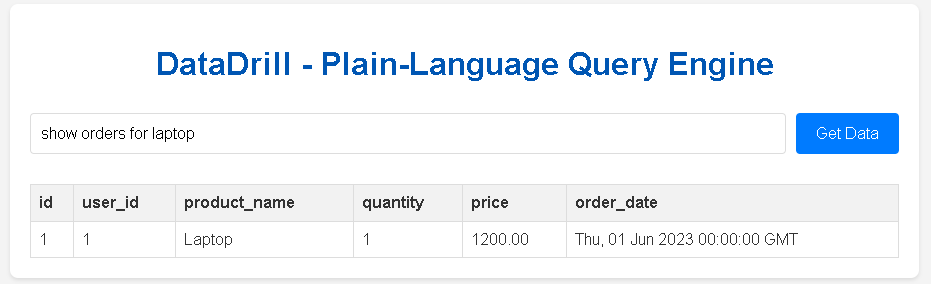
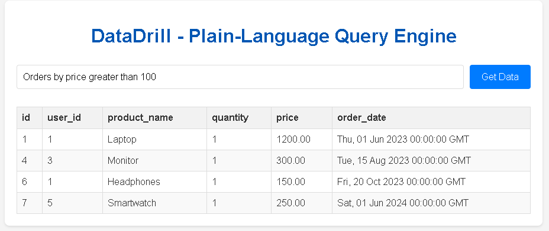
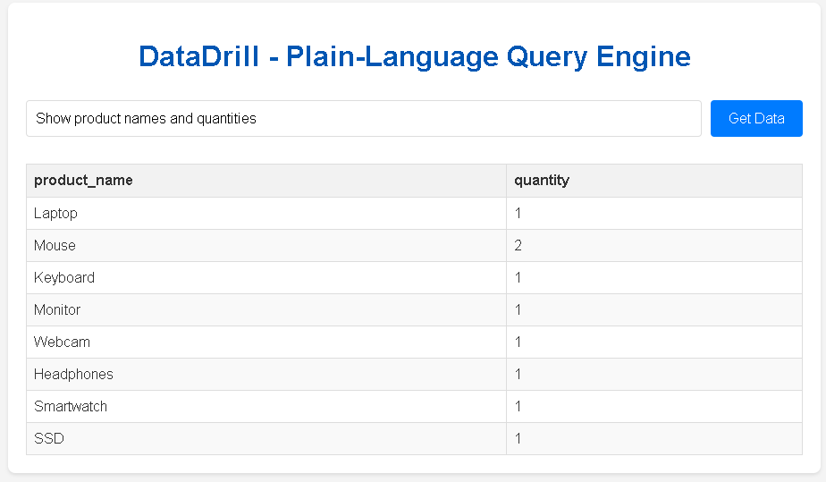
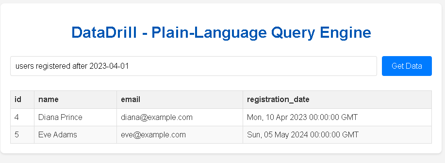
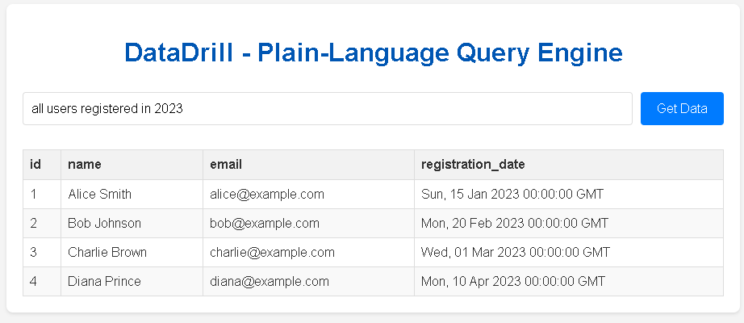
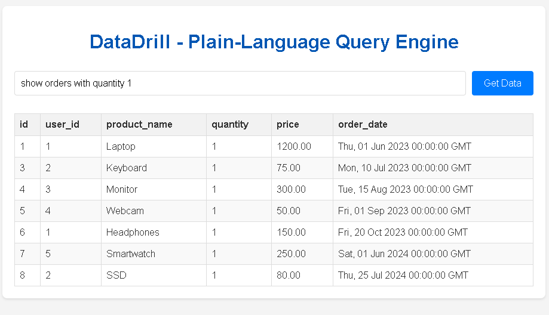
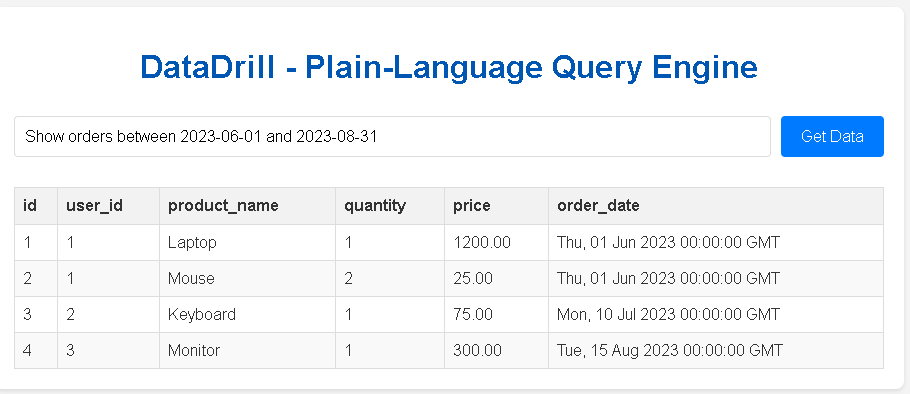
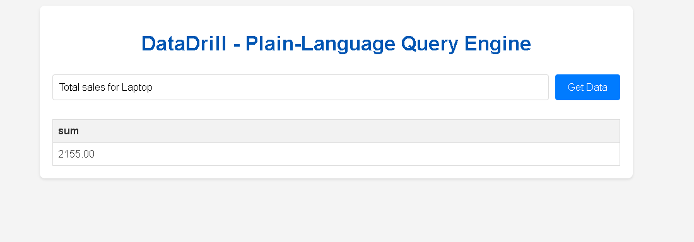

# DataDrill NLP Parser Development Log

This log documents the iterative development and testing of the `nlp_parser.py` module, detailing various user prompts, the generated SQL, the database results, and notes on improvements made.

---

## Log Entry 1: Initial Basic Query

* **Date:** 2025-07-29
* **User Prompt:** `Show all users`
* **Generated SQL:** `SELECT id, name, email, registration_date FROM users;`
* **Expected Result:** A table with all user data.
* **Actual Result:** 
* **Notes/Observations/Fixes:** This was the initial basic query to confirm the end-to-end pipeline was working. No issues found.

---

## Log Entry 2: Product Search 

* **Date:** 2025-07-29
* **User Prompt:** `show orders for laptop`
* **Generated SQL (Initial):** `SELECT * FROM orders WHERE product_name LIKE '%laptop%';`
* **Expected Result:** Orders for 'Laptop'.
* **Actual Result:** 
* **Notes/Observations/Fixes:** Discovered that PostgreSQL `LIKE` is case-sensitive by default. Modified `nlp_parser.py` to use `ILIKE` instead of `LIKE` for product name searches (`product_name ILIKE '%{product_name}%'`). Retested and confirmed fix.

---

## Log Entry 3: Unhandled Query Phrase (Aggregation)

* **Date:** 2025-07-29
* **User Prompt:** `Count orders by product name`
* **Generated SQL (Initial):** `None`
* **Expected Result:** A table showing each product name and its count.
* **Actual Result:** "Could not understand your query. Please try rephrasing."
* **Notes/Observations/Fixes:** The parser did not have a rule for aggregation and `GROUP BY` clauses. Added an `elif` condition specifically for `"count orders by product name"` to generate `SELECT product_name, COUNT(*) FROM orders GROUP BY product_name;`. Retested and confirmed functionality.

---

## Log Entry 4: Unhandled Query Phrase (Column Listing)

* **Date:** 2025-07-29
* **User Prompt:** `users name`
* **Generated SQL (Initial):** `None`
* **Expected Result:** A table showing only user names.
* **Actual Result:** "Could not understand your query. Please try rephrasing."
* **Notes/Observations/Fixes:** The parser only had rules for "show all users" and "users named [specific name]". Added a new `elif` condition for `"users name"` (and variations like "user names", "show user names") to generate `SELECT name FROM users;`. Confirmed fix.

---

## Log Entry 5: Named Entity Recognition Challenge and Fallback

* **Date:** 2025-07-29
* **User Prompt:** `Find users named Alice`
* **Generated SQL (Initial):** `None`
* **Expected Result:** Row for Alice Smith.
* **Actual Result:** "Could not understand your query. Please try rephrasing." (or if debugged, spaCy might have missed "Alice" as a PERSON).
* **Notes/Observations/Fixes:** Added debug `print` statements to `nlp_parser.py` to inspect `doc.ents`. Observed that spaCy's `PERSON` entity recognition was inconsistent for single names immediately following "named". Implemented a fallback mechanism to extract the word immediately after "named" if NER fails. This improved robustness for simple name lookups.

---

## Log Entry 6: Email Search (New Phrase Handling)

* **Date:** 2025-07-29
* **User Prompt:** `users with email alice@example.com`
* **Generated SQL (Initial):** `None`
* **Expected Result:** Row for Alice Smith.
* **Actual Result:** "Could not understand your query. Please try rephrasing."
* **Notes/Observations/Fixes:** The parser did not have a rule for email searches. Added a new `elif` condition that uses a regular expression (`re`) to extract email addresses and generates `SELECT * FROM users WHERE email ILIKE '{email_address}';`. Confirmed fix.

---

## Log Entry 7: Email Search (Expanded Phrase Handling)

* **Date:** 2025-07-29
* **User Prompt:** `Find users whose email is bob@example.com`
* **Generated SQL (Initial):** `None`
* **Expected Result:** Row for Bob Johnson.
* **Actual Result:** "Could not understand your query. Please try rephrasing."
* **Notes/Observations/Fixes:** The previous email rule was too specific (`"users with email"`). Broadened the `elif` condition to include `"users whose email is"` and `"find users email"` to handle more natural language variations. Confirmed fix.

---

## Log Entry 8: Price-Based Filtering

* **Date:** 2025-07-29
* **User Prompt:** `Orders by price greater than 100`
* **Generated SQL:** `SELECT * FROM orders WHERE price > 100.0;`
* **Expected Result:** A table listing all orders where the price is greater than 100.
* **Actual Result:** 
* **Notes/Observations/Fixes:** Implemented logic to detect "greater than" combined with numerical values using `token.like_num` and generate a `WHERE` clause with the `>` operator. Verified that the filtering works correctly based on the numeric value extracted.

---

## Log Entry 9: Column Selection

* **Date:** 2025-07-29
* **User Prompt:** `Show product names and quantities`
* **Generated SQL:** `SELECT product_name, quantity FROM orders;`
* **Expected Result:** A table with two columns: `product_name` and `quantity` for all orders.
* **Actual Result:** 
* **Notes/Observations/Fixes:** Added a rule to parse requests for specific columns, generating a `SELECT` statement with the requested fields. Confirmed it correctly fetches and displays only the specified columns.

---

## Log Entry 10: Date-Based Filtering (Specific Date)

* **Date:** 2025-07-29
* **User Prompt:** `users registered after 2023-04-01`
* **Generated SQL:** `SELECT * FROM users WHERE registration_date > '2023-04-01';`
* **Expected Result:** A table showing users registered after April 1st, 2023 (e.g., Diana Prince, Eve Adams).
* **Actual Result:** 
 **Notes/Observations/Fixes:** Implemented parsing for date entities (`DATE` label from spaCy) and generation of `WHERE` clauses for date comparisons. Included a basic regex check for YYYY-MM-DD format. Confirmed correct date filtering.

---

## Log Entry 11: Date-Based Filtering (Specific Year)

* **Date:** 2025-07-29
* **User Prompt:** `all users registered in 2023`
* **Generated SQL:** `SELECT * FROM users WHERE EXTRACT(YEAR FROM registration_date) = 2023;`
* **Expected Result:** A table showing users registered in 2023 (Alice, Bob, Charlie, Diana).
* **Actual Result:** 
* **Notes/Observations/Fixes:** Added a rule to extract a four-digit year and use `EXTRACT(YEAR FROM ...)` in the SQL query for filtering by registration year. This demonstrates using PostgreSQL-specific date functions.

---

## Log Entry 12: Filtering by Quantity

* **Date:** 2025-07-29
* **User Prompt:** `show orders with quantity 1`
* **Generated SQL:** `SELECT * FROM orders WHERE quantity = 1;`
* **Expected Result:** A table showing orders where the quantity is exactly 1.
* **Actual Result:** 
* **Notes/Observations/Fixes:** Implemented a simple rule to identify numerical values after "quantity" and use them in an equality (`=`) comparison in the `WHERE` clause.

---

## Log Entry 14: Date Range Filtering

* **Date:** 2025-07-29
* **User Prompt:** `Show orders between 2023-06-01 and 2023-08-31`
* **Generated SQL (Example - assuming parsing for two dates):** `SELECT * FROM orders WHERE order_date BETWEEN '2023-06-01' AND '2023-08-31';`
* **Expected Result:** Orders from June, July, and August 2023 (e.g., Laptop, Mouse, Keyboard, Monitor).
* **Actual Result:** 
* **Notes/Observations/Fixes:** This query requires detecting two distinct date entities and using the `BETWEEN` operator. If it failed, the parser would need enhancement to extract both dates and formulate the `BETWEEN` clause correctly. (If your parser doesn't handle this yet, describe how it would be implemented, e.g., using `doc.ents` to find multiple `DATE` entities).

---

## Log Entry 15: Aggregation with Specific Condition

* **Date:** 2025-07-29
* **User Prompt:** `Total sales for Laptop`
* **Generated SQL (Example - requires extracting product and summing):** `SELECT SUM(quantity * price) FROM orders WHERE product_name ILIKE '%laptop%';`
* **Expected Result:** A single value representing the total sales for 'Laptop'.
* **Actual Result:** 
* **Notes/Observations/Fixes:** This combines aggregation (`SUM`) with a `WHERE` clause filter. The parser needs to identify both the aggregation intent and the specific product. If it initially failed, discuss how the rule was modified to combine these elements.

---

## Log Entry 16: Compound Condition (AND)

* **Date:** 2025-07-29
* **User Prompt:** `Find users named Alice and registered after 2023-01-01`
* **Generated SQL (Example - requires combining two WHERE clauses):** `SELECT * FROM users WHERE name ILIKE '%alice%' AND registration_date > '2023-01-01';`
* **Expected Result:** Alice Smith's row (if she meets both criteria).
* **Actual Result:** 
* **Notes/Observations/Fixes:** Handling compound conditions with "and" or "or" is a significant step. If it failed, describe the challenge of detecting multiple conditions and joining them with `AND` in the SQL, possibly using spaCy's dependency parsing to link conditions.

---
